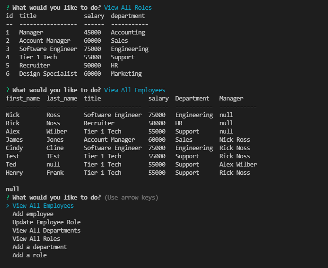

# EMPLOYEE TRACKER

[](https://github.com/msp4msps)
[](https://github.com/msp4msps/employee_tracker)
[](https://github.com/msp4msps/employee_tracker)
[](https://choosealicense.com/licenses/mit/)

## Table of Content

- [ Project Links ](#Project-Links)
- [ Screenshots](#Screenshots)
- [ Project Description ](#Project-Description)
- [ User Story ](#User-Story)
- [ Technologies ](#Technologies)
- [ Installation ](#Installation)
- [ Usage ](#Usage)
- [ Credits and Reference ](#Credits-and-Reference)
- [ Tests ](#Tests)
- [ Contributing ](#Contributing)
- [ Questions ](#Questions)
- [ License ](#License)

#

## Project Links

https://github.com/msp4msps/employee_tracker<br>
https://watch.screencastify.com/v/kCyxBHteYcITl0xQv6KH

## Screenshots-Demo

<kbd></kbd><kbd></kbd>

## Project Description

command-line application from scratch to manage a company's employee database, using Node.js, Inquirer, and MySQL.

## User Story

AS A business owner, I WANT to be able to view and manage the departments, roles, and employees in my company SO THAT I can organize and plan my business

## Technologies

```
Nodejs,Inquirer,MySQL
```

## Installation

Fork the repo and clone it locally

## Usage

Create a .env file with secrets to connect to your MySQL instance. Connect to Mysql in the terminal and run SOURCE db/schema.sql to populate the database. You can also run SOURCE db/seeds.sql to populate the database with fake information. After this is done, quit MySQL and run npm start to get the CLI to populate. Make different selections to read and write to the db.

## Credits and Reference

None

## Tests

Use the instructions provided above.

## Contributing

Open a pull request

## Questions

Contact the author with any questions!<br>
Github link: [msp4msps](https://github.com/msp4msps)<br>
Email: msp4msps@tminus365.com

## License

This project is [MIT](https://choosealicense.com/licenses/mit/) licensed.<br />
Copyright © 2021 [NICK ROSS](https://github.com/msp4msps)
